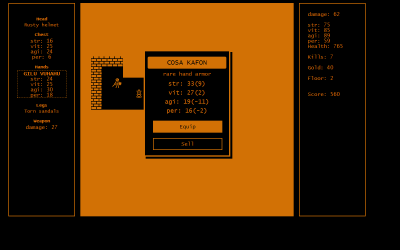

# \
ine Descent
### a 13kb endless RPG adventure  

Created for [js13kGames](http://js13kgames.com/) competition.  

Made out of divs only, no canvas involved. _11 kilobytes with all the dependencies._ 

Venture into the depths of an endless procedurally generated dungeon,
hunt for greater loot, earn gold and try to stay alive for as long as you can.

This is the very early release, many things should and must be improved, feel free to open an issue or a pull request.
Zipped game (with all the assets and deps) must not exceed **13k** bytes.

##### How to play:

- clone repo or download zip
- unzip
- run `index.html`  

Cursors to move.   
If you decide to equip a new piece of gear an old one will be replaced and sold.

First foe is the hardest so steel yourself.

##### How to develop:

- fork
- clone
- `npm install`
- `npm start`

 